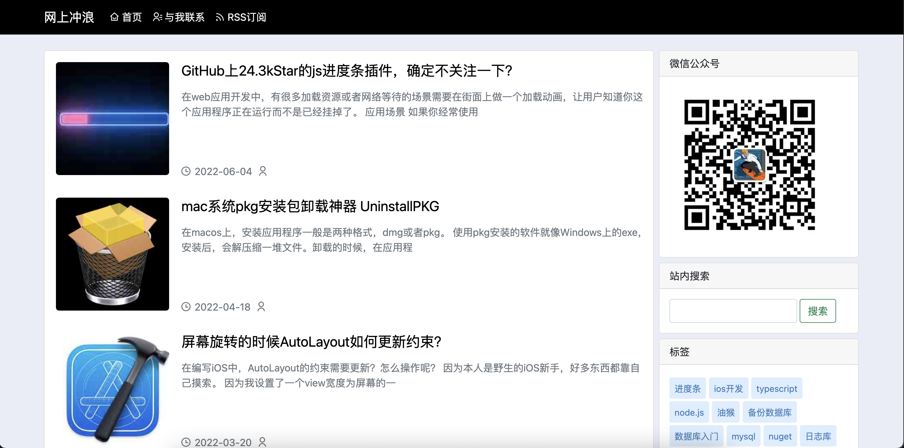
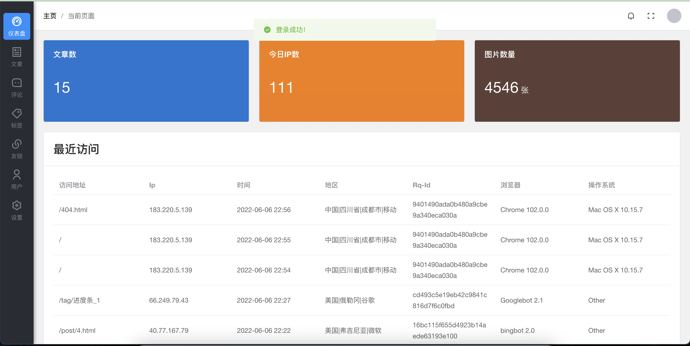

# Panda博客系统

<div align="center">

一个使用`ASP.NET Core MVC 6.0`开发的`博客`系统，目前正在开发中...

        [](https://github.com/coolqingcheng/Panda) [](https://github.com/coolqingcheng/Panda)  

 </div>

## ✨ 环境支持

- 使用`ASP.NET Core MVC 6.0`开发
- 后台前端使用Vue 3.x + Element-plus开发
- .NET 6.0
- Visual Studio 2022 或 Rider
- MySQL 8.0.x【或者其他EF驱动适配的数据库，默认使用mysql】

## 🥩 在线示例

网上冲浪博客：[https://iwscl.com/](https://iwscl.com/)








## 🚗 如何使用
###  前台

主工程目录`"/Panda.Site"`，使用 `ASP.NET Core MVC 76.0` 开发，包括网站前台，正确运行前，请先对项目进行配置，请看下面说明。


在工程`Panda.Site`的`Site.Development.ini`文件中添加节点,如果是部署上线，请使用`Site.Production.ini`，配置MySQL连接字符串

``` ini
[Site]

Name = 网上冲浪

Domain = http://localhost:5052

[ConnectionStrings]

MYSQL = server=localhost;user=[username];database=[databasename];port=[port];password=[password];SslMode=None

```

#### 数据迁移

打开程序包控制台，选择项目：`Panda.Entity`，执行以下命令：

```shell
Update-Database
```

如果删除了`Panda.Entity/Migrations`目录，就执行以下命令即可

```shell
Add-Migration InitDB
Update-Database
```

> 如果你使用是dotnet cli，也可以参考对应的EF迁移命令

#### 打包发布

后台使用vue.js 3.x+element-plus开发，包管理器使用的yarn (如果你喜欢，也可以使用npm)

后台文件在`Admin`下


- 安装依赖

```shell
yarn
```

- 调试运行

```shell
yarn dev
```

- 打包后台的前端静态文件

```shell
yarn build
```

- 发布

```shell
dotnet publish
```


## 4 docker支持

> todo 构建脚本待完善

## ☀️License

MIT

## 💖感谢jetbrains

本项目得到  [jetbrains](https://jb.gg/OpenSourceSupport) 的支持


